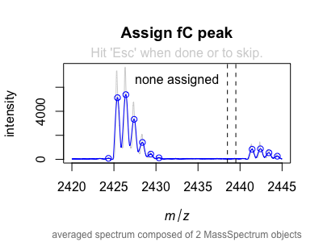
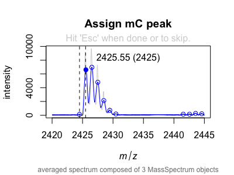

```{r, include = FALSE}
knitr::opts_chunk$set(
  collapse = TRUE,
  comment = "#"
)

options(summerr.debug = FALSE)
```

## Introduction

This vignette will outline a specfic use-case of the the `summerrmass` package.

The package is loaded to the R session by calling:

```{r setup}
library(summerrmass)
```

Since the package is not part of CRAN, you must install (once) and update it from  
its GitHub repository.

```{r eval=FALSE}
install.packages("githubinstall")  # if you have not installed "githubinstall"
githubinstall::gh_install_packages("summerrmass")
```

### Aim of the Analysis

We are going to extract the intensity of MALDI spectra at three selected m/z 
ratios from an array of MALDI measurements that have been acquired in the
presence of increasing inhibitor concentrations.

We want to use the decline in intensity to fit the IC50.

### Organization of the Raw Data


## Extracting selected peak intensities from MALDI spectra

Here, we will use the pre-built pipeline that ships with the package. If you want
to learn how to built up a smaller analysis step-by-step, check out the examples
in the documentation or the vignette on the package's basic functions.

To adapt the pipeline to your needs, some arguments need probably to be adapted.
This is outlined below in a bit more detail. However, `maldi_batch` is written
in such a way that you can even exchange certain functions that are used for the
individual steps and replace them with modified versions.[^1]

[^1]: Provided that the modified functions return objects of similar type
and structure to the original ones.

So, here is how the full call to `maldi_batch` looks like. I have included also
most presets for your information. The arguments which you are most likely to 
adapt to your own needs are indicated with `(*)`.

```{r batch_import, eval=FALSE}
data_maldi <- maldi_batch(
  path  = NULL,  # will prompt for the direcotry to analyze
  layout_file = NULL,  # will prompt for each sample group
  pivot = "[0-9]_[A-Z]+[0-9]+",  # regex to match the "well" folders (*)
  # pre-processing of spectra
  FUN_spect = maldi_average_by_well,
  MoreArgs_spect = list(pivot = "[0-9]_[A-Z]+[0-9]+", # (*)
                        final_trim_range = c(2420, 2445),  # (*)
                        method_baseline = "SNIP",
                        method_average  = "mean"), 
  # detecting peaks
  FUN_peaks = maldi_find_peaks_by_well,
  MoreArgs_peaks = list(pivot = "[0-9]_[A-Z]+[0-9]+",  # (*)
                        mass_list = c(mC = 2425, hmC = 2441, fC = 2439),  # (*)
                        tolerance_assignment = 0.5,
                        SNR = 3,
                        method = "MAD"),
  # drawing spectra
  MoreArgs_draw = list(ncol = 2, nrow = 6),
  # associating metadata
  FUN_import_layout = import_layout_from_excel,
  MoreArgs_layout = list(sheet = 1,
                         index_row = "2",
                         index_col = "A",
                         data_upper_left = "B3",
                         plate_nrow = 16,
                         plate_ncol = 24,
                         meta_row = list(
                           # metadata stored in rows
                           concentration = "1"),
                         meta_col = list(
                           # metadata stored in columns
                         ))
)

```

The most important argument the pipeline is the **pivot**, which is a regular
expression to identify a folder in a path that (1) 
groups the measurements from the same sample, i.e., the same well, and
(2) that is used to associate metadata, e.g., treatment
conditions, with the sample. You may want to check out `?import_layout_from_paths` 
for the technical details.

### Importing the spectra

Spectra are always imported using `maldi_import_spectra`. This cannot be modified
in the pre-built pipeline. There might neither be a need to do so as it simply
reads-in the files.

### Pre-processing of spectra

We use a pre-built pre-processing pipeline implemented in `maldi_average_by_well`
by default. This mini-pipeline involves:

1. Removing the baseline from the spectra

2. Aligning the spectra of ech sample group

3. Trimming them to the final mass range needed for the analysis[^2]

[^2]: Although it is possible to work with the full spectra, trimming to an appropriate
range will considerably speed up the subsequent steps.

As mentioned in the beginning, you may consider to write your own function for 
pre-processing if you need more control than what is provided by changing some
arguments.

### Detecting peaks and drawing intermediate spectra

The most valuable piece of information that must be provided is the (named) vector 
of m/z ions to measure. In this example, we would like to quantify the intensity
of three ions: `c(mC = 2425, hmC = 2441, fC = 2439)`.

By default, the workflow will try to identify the correct peaks in a semi-automatic
manner. However, there are different options to control this behavior (not shown 
in the example above); see `?maldi_batch` for details.

In the default process, you may be prompted to click on the peaks where there is
ambiguity:

{width=300px}
{width=300px}

It is important that you remember to hit the 'Esc' key (or the 'Finish' button in 
RStudio) when you have successfully clicked on the correct peak. Only after that, 
the open circle will fill and the process continue.
In the mass spectrum on the right side, there is no peak, so you hit 'Esc' right 
away.
In the left one, there were two peaks within the acceptable range
(`tolerance_assignment`), so you identfiy the correct one and hit 'Esc'.

If you mistakenly clicked a wrong peak, don't worry. By default, you are asked
to review all assignments in a temporarily created PDF document using 
`maldi_draw_peaks_by_well` and to enter the well identifier (pivot) of those
spectra you wish to re-assign manually.

### Backing up spectra and peak assignments

Upon successful completion of each step, two `.rds` files are deposited in the
folders you just analyzed, which allows you to easily import a previous analysis
when you run `maldi_batch` on this folder (or a folder enclosing the folder).

### Association with a plate layout

In the final step of the pipeline, you will be asked to associate metadata with
the spectra. If you want to use always the same file, or a file with the same
name for each group of samples (MALDI plates), consider providing the full or
relative file name as `layout_file` (see `?maldi_batch`).

A convenient way is to provide the layout as Excel sheet. Please refer to
`?import_layout_from_excel` for the details and which arguments you should
provide to the function via `MoreArgs_layout`. In case you want to use a different
specification, feel free to feed another function to `FUN_import_layout = ...`.

### Returned object

Once `maldi_batch(...)` has finished, `data_maldi` contains two lists, one with
the spectra and one with the peaks and associated layout.

```{r include=FALSE}
data_maldi <- readRDS("data_maldi.rds")
```

```{r}
lengths(data_maldi)  # each list contains the result of 1 group

lapply(data_maldi, lengths)  # 12 spectra 

head(data_maldi$peaks[[1]])
```

## Creating a resume file

With the data at hand, we want to arrange the spectra per compound on a single 
page in a PDF document. In a future version, this could be expanded to arrange
the plots automatically by increasing/decreasing concentration in rows etc.

```{r eval=FALSE, include=TRUE}
for (group in seq_along(data_maldi$peaks)) {
  
  pdf(file = file.path(attr(data_maldi$spectra[[group]], "dir"), 
                       "overview_by_compound.pdf"),
      width = 21.5 / 2.54, height = 30.5 / 2.54, paper = "a4")
  
  for (content in unique(data_maldi$peaks[[group]]$content)) {
    
      maldi_draw_peaks_by_well(data_maldi$spectra[[group]], 
                               data_maldi$peaks[[group]][which(
                                 data_maldi$peaks[[group]]$content == content), ],
                               highlight_missing_peaks = FALSE, title = content, 
                               ncol = 2, nrow = 6)
    
  }
  
  dev.off()
  
}
```

## Fitting IC50 values

```{r}
data_ic50 <- list()

for (group in seq_along(data_maldi$peaks)) {
  
  log_task("fitting IC50 for", sQuote(names(data_maldi$peaks)[[group]]))
  
  data_ic50[[group]] <- data_maldi$peaks[[group]] %>%
    # ensure variables are numeric
    mutate(concentration = as.numeric(concentration)) %>% 
    # filter out missing values for proper augmenting
    filter(!is.na(percent), !is.na(concentration)) %>%
    # 
    group_by(content, ion) %>% 
    fit_IC50(percent ~ concentration)
  
}
```


